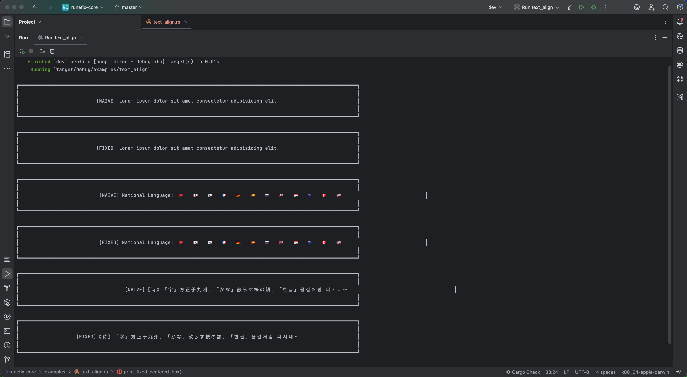
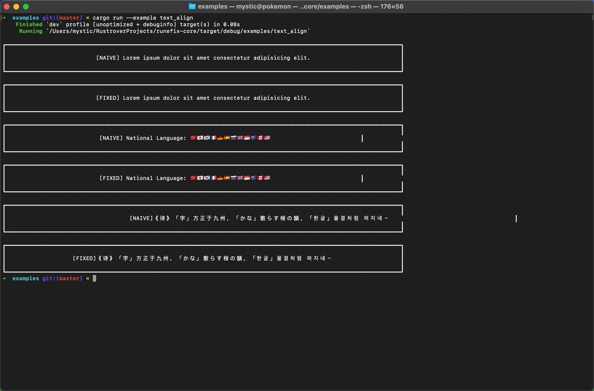
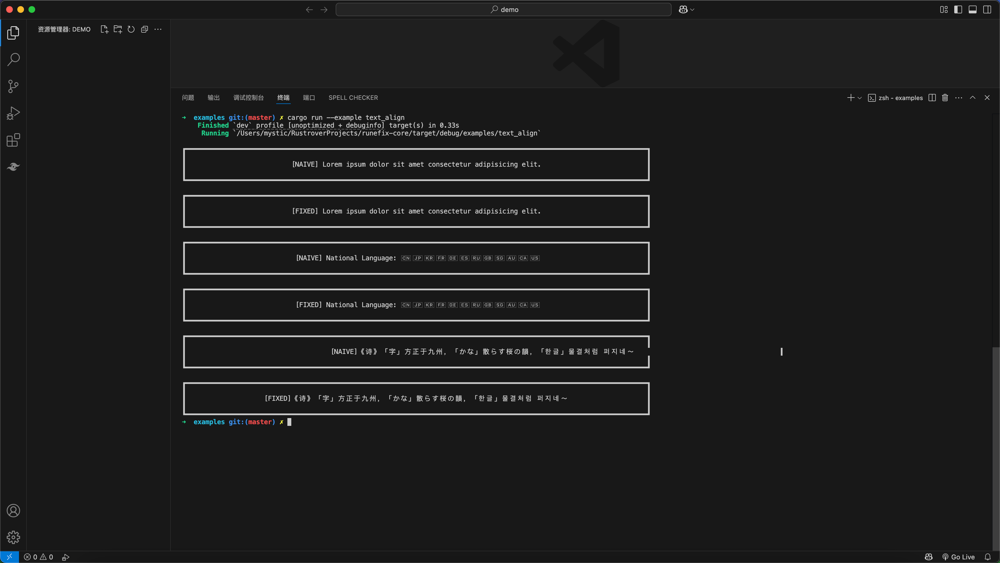
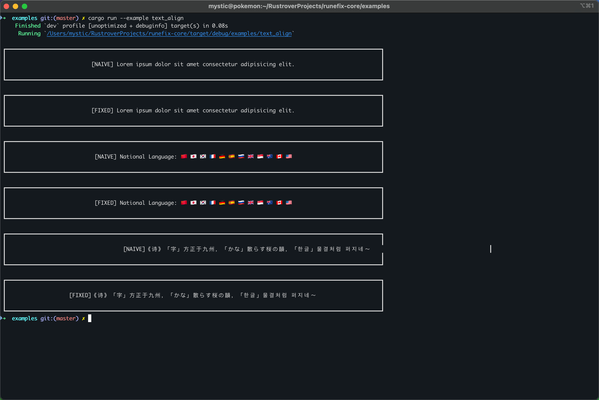

# `text_align.rs` Example

This example demonstrates how grapheme-aware width correction helps properly center multilingual and emoji-rich text.

## ❌ Misaligned with `text.chars().count()` and certain terminals

Some terminals—such as the default macOS Terminal or integrated terminals in JetBrains IDEs and VSCode—do not properly account for emoji and CJK widths.

## ✅ Correct with `runefix_core` and compatible terminals

When paired with a Unicode-aware terminal like iTerm2, `runefix_core` ensures correct alignment—even for mixed emoji and CJK input.

## Key Insight

Accurate width detection is necessary—but **not sufficient**.  
Proper alignment depends on both:

1. A reliable width engine (like `runefix_core`)
2. A terminal that respects Unicode column widths

- ✅ `iTerm2` renders aligned output correctly (and possibly other modern terminals).
- ⚠️ `JetBrains` / `VSCode` built-in terminals frequently misalign complex emoji or CJK characters.
